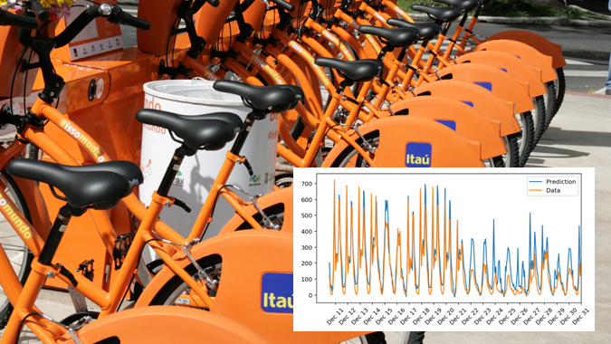

# Deep Learning for bike sharing prediction

Apply Deep Learning to solve real prediction problems.

Build a neural network from scratch to carry out a prediction problem on a real dataset comes from the UCI Machine Learning Database.
Skills: Gradient descent and backpropagation.

